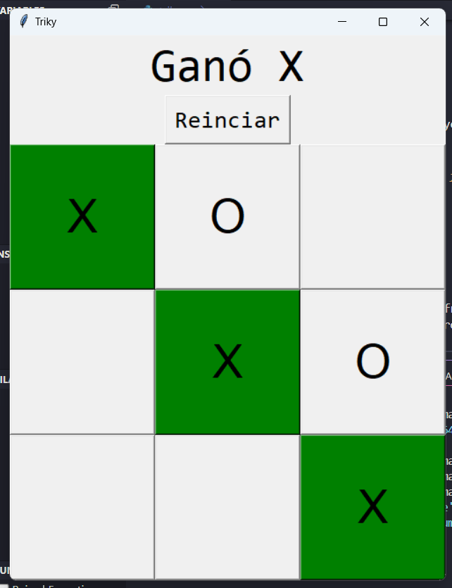

# Juego Tic Tac Toc

## índice

**1.** [Descripción](#descripción)

**2.** [¿Cómo puede ser clonado?](#cómo-puede-ser-clonado)

**3.** [Instalación](#instalación)

**4.** [Herramientas utilizas](#herramientas-utilizadas)

**5.** [Uso](#uso)

**6.** [Estructura del código](#estructura-del-codigo)

**7.** [Captura del código](#captura-del-codigo)

**8.** [Autor](#autor)

## Descripción 
Este proyecto es un juego interactivo de Triky (Tres en Raya o Tic-Tac-Toe) desarrollado en Python con la biblioteca Tkinter. Permite a dos jugadores turnarse para colocar sus símbolos ("X" y "O") en un tablero de 3x3, con el objetivo de alinear tres símbolos iguales en fila, columna o diagonal. El programa verifica automáticamente si hay un ganador o si el juego ha terminado en empate, coloreando las casillas correspondientes. La interfaz es intuitiva y proporciona botones para reiniciar la partida y mostrar de forma clara el turno actual. El juego es accesible y puede ejecutarse en diferentes dispositivos con soporte para Python y Tkinter.

## ¿Cómo puede ser clonado?

### 1. Clona este repositorio en tu máquina local

Para clonar este proyecto, puedes utilizar Git. Asegúrate de tener Git instalado en tu sistema. Luego, puedes clonar el repositorio ejecutando el siguiente comando en tu terminal:

Copiar código: **git clone <[URL del repositorio](https://github.com/lppz16/Calculadora-html-css.git)>**

## Instalación
Para ejecutar la calculadora en tu propio entorno, sigue estos pasos:

**1.** Clona el repositorio utilizando el comando mencionado anteriormente.

**2.** Navega al directorio del proyecto:
Copiar código: **cd Calculadora-html-css**

**3.** Abre el archivo index.html en tu navegador preferido. Puedes hacerlo haciendo doble clic en el archivo o arrastrándolo a la ventana del navegador.

## Herramientas utilizadas

Para el desarrollo del proyecto de Triky, se utilizaron las siguientes herramientas:

**Python:** El lenguaje de programación principal utilizado para implementar la lógica del juego y la interfaz gráfica.

**Tkinter:** Una biblioteca estándar de Python para crear interfaces gráficas de usuario (GUI). En este proyecto, se utiliza para generar la ventana del juego, los botones que representan el tablero, la etiqueta que muestra el turno actual y el botón para reiniciar la partida.

**Random:** La biblioteca estándar de Python que se usa para seleccionar aleatoriamente el jugador que inicia la partida. Esto agrega un elemento de variabilidad al juego.

## Uso

Para jugar, sigue estos pasos:
Una vez que el programa se ejecute, aparecerá una ventana con un tablero de 3x3, una etiqueta indicando el turno del jugador actual ("X" o "O") y un botón para reiniciar el juego.

**Turno de los Jugadores:**
Haz clic en una casilla vacía para colocar tu símbolo ("X" o "O"). El turno se alterna automáticamente entre los jugadores.
La etiqueta en la parte superior indicará de quién es el turno actual.

**Condiciones de Victoria o Empate:**
Si un jugador alinea tres de sus símbolos (en fila, columna o diagonal), el juego mostrará el ganador coloreando las casillas ganadoras de verde.
Si no hay más casillas disponibles y no hay un ganador, el juego declara un empate y colorea el tablero de rojo.

**Reiniciar la Partida:**
Para comenzar una nueva partida, haz clic en el botón "Reiniciar". El tablero se restablecerá y el juego elegirá aleatoriamente quién comienza.

**Cerrar el Programa:**
Para salir del juego, cierra la ventana de Tkinter.

## Estructura del código:
La estructura del código está organizada de la siguiente manera:

**1. Importación de Módulos**
from tkinter import *
import random

**Se importan las bibliotecas necesarias:**
tkinter para crear la interfaz gráfica.
random para seleccionar aleatoriamente el jugador que inicia.

**2. Funciones del Juego**
Estas funciones gestionan la lógica del juego, verifican el estado del tablero y manejan la interfaz gráfica.

**next_turn(row, column):**
Controla los turnos de los jugadores.
Actualiza la interfaz con el símbolo del jugador actual ("X" o "O") y verifica si hay un ganador o un empate después de cada movimiento.

**check_winner():**
Verifica si hay tres símbolos iguales en una fila, columna o diagonal.
Cambia el color de las casillas ganadoras a verde.
Si no hay un ganador y el tablero está lleno, declara un empate y colorea las casillas de rojo.

**empty_spaces():**
Revisa si quedan casillas vacías en el tablero.
Devuelve False si no hay espacios disponibles, lo cual indica un empate.

**new_game():**
Restablece el tablero para iniciar una nueva partida.
Elige aleatoriamente al jugador que comienza.

**3. Configuración de la Interfaz Gráfica**
Se crean y configuran los elementos de la interfaz gráfica.

**Ventana Principal (window):**
Se crea una instancia de Tk para la ventana principal del juego y se configura el título.

**Variables y Arreglos:**
players es una lista que almacena los símbolos de los jugadores ("X" y "O").
player selecciona al azar al jugador que empieza.
buttons es una matriz de 3x3 para representar los botones del tablero.

**Componentes de la Interfaz:**
**Etiqueta (Label):** Muestra el turno actual o el resultado del juego.
**Botón de Reinicio (Button):** Permite reiniciar el juego llamando a new_game().
**Marco (Frame) y Botones del Tablero:** Se crea un marco para organizar los botones en una cuadrícula de 3x3. Cada botón se configura con su respectiva acción para gestionar los clics.

**4. Bucle Principal del Programa**
window.mainloop()
Ejecuta el bucle principal de la interfaz, manteniendo la ventana abierta y permitiendo la interacción con los elementos gráficos.

## Captura del proyecto:

## Autor

Yan Frank Ríos López
